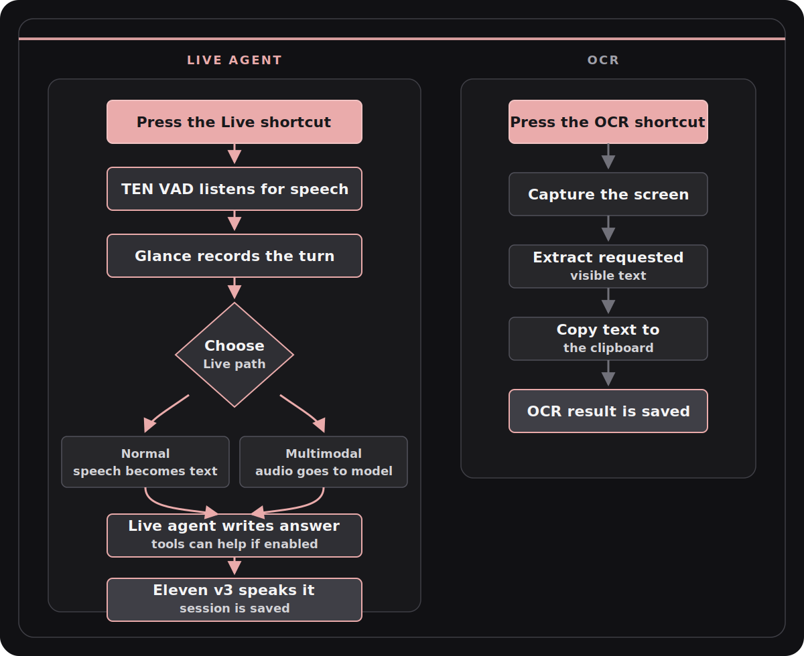

<div align="center">
  
  <h1>Glance</h1>
  <p><strong>Press a shortcut. Speak. Get the answer back out loud.</strong></p>
  <p>
    
    
    
    
  </p>
  
</div>

## About

Glance is my OOP coursework project: a macOS live agent app that stays out of the way until I need it.

I press a customizable shortcut, speak, and Glance runs a Live turn. If I only need text from the screen, I use OCR and Glance copies the extracted text to the clipboard.

## Features

- Customizable shortcuts.
- Configurable OpenAI-compatible endpoints for reply, transcription, and voice. (Or use a multimodal model that can understand audio and write the reply in one step.)
- [Eleven v3](https://elevenlabs.io/docs/overview/models#eleven-v3) voice output, currently the best multilingual TTS model, with excellent voice quality and support for different emotions. (Supported by Glance.)
- Advanced TEN VAD audio detection for natural speech turns.
- Various tools available for the live agent to use.
- Saved history with transcript, response, audio, screenshots, and tool records.
- Saved memories that the live agent can read and update.

## How It Works

<p align="center">
  
</p>

## Tools

| Tool | Description |
| --- | --- |
| Screenshot | Captures the screen for better context. |
| OCR | Extracts requested text from the screen and copies it to the clipboard. |
| Web search | Searches the web for latest information. |
| Web fetch | Fetches data from a specific URL. |
| Add memory | Saves a task, idea, preference, plan or a project note. |
| Read memory | Searches saved memories. |
| Change memory | Updates a saved memory when the user asks to edit or correct it. |

## Using The App

1. Open Glance.
2. Configure reply, transcription, and voice providers in settings.
3. Set the Live, OCR, and Open Glance shortcuts.
4. Choose audio devices and voice settings.
5. Enable only the tools you want the live agent to use.
6. Press the Live shortcut and speak.
7. Press the OCR shortcut when you want visible text copied from the screen.

Settings are saved in `~/.glance/config.json`. Sessions are saved under `~/.glance/sessions`. Memories are saved in `~/.glance/memories.json`.

## Prerequisites

- macOS.
- Python 3.10+ with `venv` and `pip`.
- Git or Xcode Command Line Tools, because `requirements.txt` installs TEN VAD from GitHub.
- Bun 1.3.x.
- Node.js 20+.
- Microphone, Screen Recording, and Accessibility permissions in macOS settings.
- Python 3.10+.
- Bun.
- Node.js `>=20`.

## Running The App

```bash
# Create and enter the Python virtual environment.
python3 -m venv .venv
source .venv/bin/activate

# Install Python and frontend dependencies.
python -m pip install -r requirements.txt

bun install
bun run build

# Open the Python backend and Electron frontend.
python3 main.py
```

## Implementation

Glance is made of Python as the backend and Electron + Next.js + Bun as the frontend, styled with Tailwind CSS v4.

| File | What it does |
| --- | --- |
| `main.py` | Opens the desktop app, or CLI mode when `--cli` is used. |
| `src/ui/qt_app.py` | macOS menu bar app, shortcuts, OCR overlay, Live control, and Electron startup. |
| `src/ui/electron_window.py` | Opens the Electron settings window and sends runtime updates to it. |
| `src/core/orchestrator.py` | Connects settings, history, memories, providers, strategies, and clipboard. |
| `src/strategies/live_strategy.py` | Records speech, gets the reply, uses tools when enabled, and plays voice output. |
| `src/strategies/ocr_strategy.py` | Captures the screen, extracts text, and copies it to the clipboard. |
| `src/tools/runtime.py` | Tool definitions and tool execution for Live mode. |
| `src/storage/json_storage.py` | Stores settings, sessions, artifacts, and conversation Markdown on disk. |
| `components/` | Electron settings UI built with Next.js and Tailwind CSS v4. |

## OOP Requirements

### Abstraction

Glance uses abstract base classes for the parts that need the same shape but different behavior.

```python
class BaseAgent(ABC):
    @abstractmethod
    def run(self, **kwargs):
        "Execute the agent's main behavior."
```

The clearest examples are `BaseAgent`, `ModeStrategy`, `BaseInteraction`, and `AbstractRepository`. The rest of the app can use those contracts without caring about the exact class behind them.

### Encapsulation

State stays inside the class that actually knows how to handle it. `AppSettings.validate()` checks settings, `TenVadAudioRecorder` handles audio capture, and `RuntimeToolRegistry` decides which tools are available.

```python
if name == "web_fetch":
    return self._settings.tool_web_fetch_policy
```

The caller does not need to know where every setting is stored. It asks the registry and gets the answer.

### Inheritance

Shared base classes are used where the app has several versions of the same kind of object:

- `LiveStrategy` and `OCRStrategy` inherit from `ModeStrategy`.
- `LLMAgent`, `OCRAgent`, `ScreenCaptureAgent`, `TranscriptionAgent`, and `TTSAgent` inherit from `BaseAgent`.
- `LiveInteraction`, `OCRInteraction`, and `QuickInteraction` inherit from `BaseInteraction`.
- `SessionDirectoryRepository` inherits from `AbstractRepository[SessionRecord]`.

### Polymorphism

The orchestrator can call `execute(...)` without needing separate code for every mode:

```python
strategy = self._strategy_factory.create(mode=mode, ...)
interaction = strategy.execute(execution_context)
```

That works because Live and OCR strategies follow the same interface.

### Composition And Aggregation

`Orchestrator` is made from smaller services: settings, history, memories, strategy factory, screen capture, transcription, LLM, OCR, TTS, and clipboard.

## Design Pattern

Glance uses **Strategy** and **Factory Method**.

`LiveStrategy` and `OCRStrategy` are separate workflows. `ModeStrategyFactory` picks the right one at runtime:

```python
if normalized_mode == "ocr":
    return OCRStrategy(...)
if normalized_mode == "live":
    return LiveStrategy(...)
```

This fits better than a Singleton because the app needs replaceable services for tests and runtime settings.

## File Reading And Writing

Glance stores app data in real files:

- `~/.glance/config.json` for settings.
- `~/.glance/sessions/.../session.json` for saved sessions.
- `~/.glance/sessions/.../conversation.md` for readable conversation export.
- `~/.glance/memories.json` for saved memories.
- Audio, speech, screenshot, OCR, and tool result artifacts.

## Testing

```bash
.venv/bin/python -m unittest discover -s tests
node --test tests/electron_window_control.test.js tests/electron_window_chrome.test.js
bun run typecheck
bun run build
```

The tests check settings validation, storage, history, Live behavior, tools, providers, OCR capture, hotkeys, Electron window control, and runtime status sync.

For Python style, I use:

```bash
.venv/bin/python -m pycodestyle main.py src tests
```

## Results

- Glance can run a full Live turn: listen, transcribe or use multimodal audio, call the model, use allowed tools, speak the answer, and save the session.
- OCR works as a quick workflow for extracting visible text and copying it to the clipboard.
- The tool system is permission-based, so disabled tools are not shown to the model.

## Conclusions

It was fun to work on this project. Glance started as a coursework idea, but it became a real desktop app I can actually use.

In the future, I would like to make Glance cross-platform. The Python backend and Electron frontend already make that realistic, but the current macOS-specific permissions, hotkeys, menu bar behavior, and screen capture integrations would need platform-specific handling.
