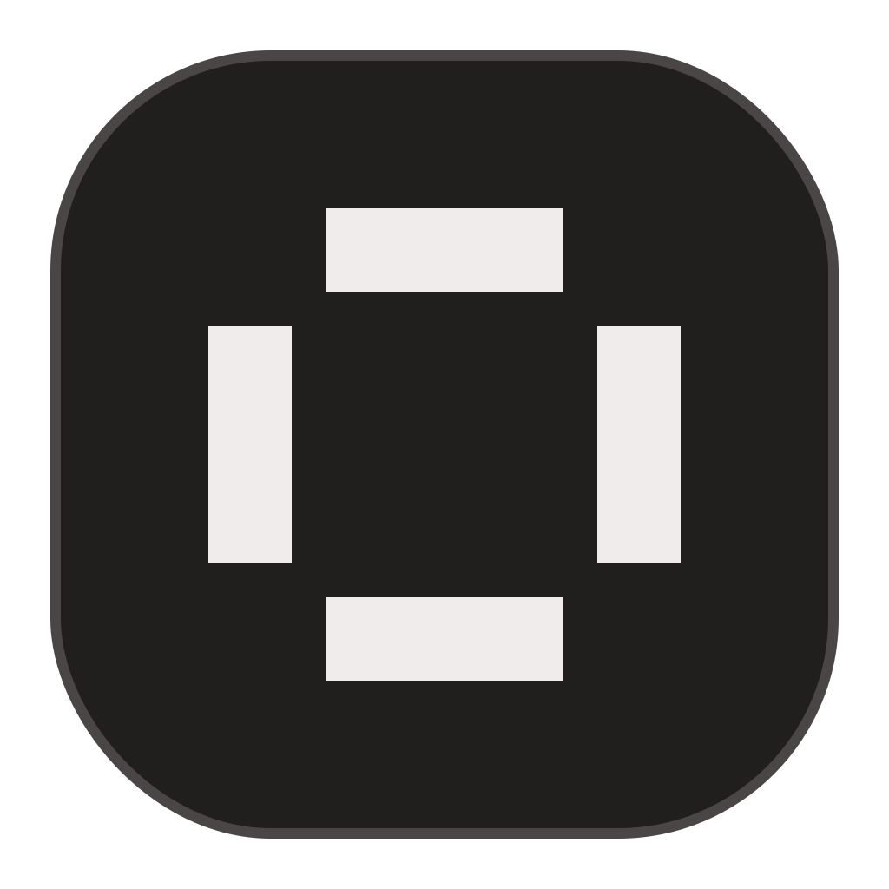
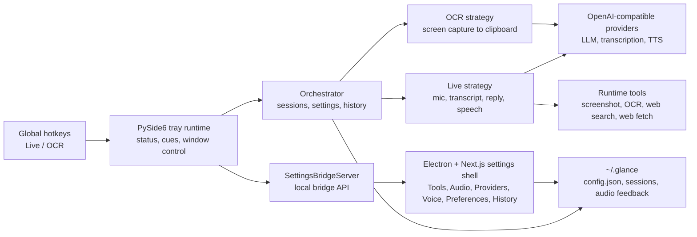

<div align="center">
  
  <h1>Glance</h1>
  <p><strong>A tray-first desktop assistant for live voice help, screen-aware tools, OCR, and spoken replies.</strong></p>
  <p>
    
    
    
    
  </p>
</div>

Glance lives in the menu bar, listens on your hotkey, and gives you short spoken help without making you leave the app you are using. The Python runtime owns capture, providers, sessions, audio, and hotkeys; the Electron + Next.js shell owns the settings experience.

The UI follows the app's own accent logic: dark charcoal surfaces, restrained borders, compact controls, and one configurable accent color used for active states, ranges, status, focus, and console logging.

<!--
When the UI walkthrough GIF is ready, place it at docs/media/glance-ui.gif and uncomment this block.

<p align="center">
  
</p>
-->

## What Glance Does

| Area | In the app | What it controls |
| --- | --- | --- |
| Tools | `Tools` | Lets Live use screen and web context when it helps: screenshots, OCR, web search, and web fetch. |
| Audio | `Audio` | Mic, speaker, speech strictness, endpoint patience, wait time, max turn length, and preroll. |
| Providers | `Providers` | OpenAI-compatible reply provider, transcription provider, TTS provider, models, reasoning, and API keys. |
| Voice | `Voice` | Auto voice selection, fixed Eleven v3 voices, and recorded voice previews. |
| Preferences | `Preferences` | Theme, accent color, prompts, Live hotkey, and OCR hotkey. |
| History | `History` | Session retention and recent Live/OCR interaction previews. |

## Architecture

<p align="center">
  
</p>

<details>
<summary>Mermaid source</summary>



</details>

## Quick Start

Glance is currently easiest to run on macOS, because it uses a PySide6 tray app, global hotkeys, audio devices, screen capture, and an Electron settings window.

```bash
python3 -m venv .venv
source .venv/bin/activate
python -m pip install -r requirements.txt

bun install
GLANCE_PYTHON=.venv/bin/python bun run dev:desktop
```

If Bun is installed through Homebrew but not on your shell `PATH`, run the launcher with the explicit binary:

```bash
BUN_BIN=/opt/homebrew/bin/bun \
GLANCE_PYTHON=.venv/bin/python \
/opt/homebrew/bin/bun run dev:desktop
```

The dev launcher starts the Next.js settings shell, waits for it to become available, then opens the Python desktop app with `GLANCE_NEXT_DEV_URL` and `GLANCE_AUTO_OPEN` set for you.

> [!TIP]
> macOS may ask for Microphone, Screen Recording, and Accessibility permissions. Glance needs those permissions for Live audio, OCR/screen context, and global hotkeys.

## Run Modes

### Desktop Dev

```bash
GLANCE_PYTHON=.venv/bin/python bun run dev:desktop
```

Use this while working on the settings shell. It runs Next.js in dev mode and points Electron at the dev server.

### Built Desktop Shell

```bash
bun run build
.venv/bin/python main.py
```

`next.config.ts` exports the settings shell into `out/`. When `GLANCE_NEXT_DEV_URL` is not set, Electron serves that static `out/index.html` through a local static server.

### CLI Fallback

```bash
.venv/bin/python main.py --cli
```

The CLI path builds the same orchestrator without opening the tray/settings shell.

## Provider Setup

Open `Providers` in the settings shell and configure:

| Field group | Used for |
| --- | --- |
| Reply provider | The Live answer model and tool-capable turns. |
| Transcription provider | Speech-to-text for Live when multimodal audio is not enabled. |
| Voice provider | Eleven v3 speech output and voice previews. |

Settings are saved to `~/.glance/config.json`. Session history, audio feedback cues, transcripts, recordings, generated speech, and tool records live under `~/.glance/sessions` and `~/.glance/audio-feedback`.

## Project Map

| Path | Purpose |
| --- | --- |
| `main.py` | Entry point for tray mode and `--cli`. |
| `src/ui/qt_app.py` | PySide6 tray runtime, global status, live cues, bridge server, and Electron shell controller. |
| `src/ui/electron_window.py` | Launches and controls the Electron settings window. |
| `app/`, `components/`, `lib/` | Next.js settings shell, Glance tabs, UI primitives, bridge types, and accent styling. |
| `src/core/orchestrator.py` | Wires settings, history, providers, agents, strategies, and clipboard services. |
| `src/strategies/live_strategy.py` | Live voice pipeline, runtime tools, OCR handoff, and speech generation. |
| `src/strategies/ocr_strategy.py` | Screen capture to OCR to clipboard flow. |
| `src/services/providers.py` | OpenAI-compatible LLM, transcription, and TTS provider calls. |
| `src/models/settings.py` | Defaults, validation, keybinds, provider fields, voice list, and `accent_color`. |
| `tests/` | Python unit coverage and focused Electron shell tests. |

## Accent System

The default accent is `#f0b100`, but Glance treats it as a setting rather than a hardcoded brand color. The same value flows through:

- `accent_color` in `AppSettings`
- CSS variables such as `--accent`, `--accent-strong`, `--accent-soft`, `--accent-border`, and `--accent-glow`
- selected navigation, sliders, switches, badges, rings, and status dots
- console log color mixing in `src/services/app_logging.py`

That is why the README uses the same yellow-on-charcoal visual language without pretending the accent can never change.

## Useful Commands

```bash
# type-check the settings shell
bun run typecheck

# build the exported Electron shell
bun run build

# run Python tests
.venv/bin/python -m unittest discover -s tests

# run focused Electron control tests
node --test tests/electron_window_control.test.js tests/electron_window_chrome.test.js
```

## Notes For UI Captures

The best README GIF should show the real first-level app names: `Tools`, `Audio`, `Providers`, `Voice`, `Preferences`, and `History`. A good capture sequence is:

1. Start on `Audio` to show the dark shell, live mic controls, and accent slider state.
2. Switch to `Tools` and toggle tool availability.
3. Open `Providers` and `Voice` briefly to show model/voice setup.
4. End on the tray status changing from `Idle` into a Live interaction.
