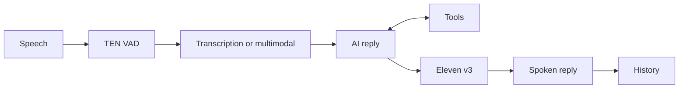

<div align="center">
  
  <h1>Glance</h1>
  <p><strong>A live desktop voice agent with screen-aware tools, natural speech, and a focused Electron settings UI.</strong></p>
  <p>
    
    
    
    
  </p>
</div>

Glance is built for the moments when typing would break your flow. Press the Live hotkey, speak naturally, and Glance listens, reasons over the request, optionally uses the tools you allowed, and answers out loud.

The app is split into two parts. Python runs the real desktop agent: audio capture, TEN VAD speech detection, providers, tools, history, hotkeys, and the macOS tray/menu bar behavior. Electron and Next.js render the settings UI: Tools, Audio, Providers, Voice, Preferences, and History.

<!--
Future README GIF slot:
docs/media/glance-ui.gif
-->

## What It Does

| Feature | What happens |
| --- | --- |
| Live voice turns | Glance records speech, sends it to the configured model path, then speaks back. |
| TEN VAD | Local voice activity detection decides when speech starts and when the turn is finished. |
| Tools | If enabled, the model can use screenshot capture, OCR, web search, and web page fetching. |
| Eleven v3 | The default TTS model is Eleven v3, chosen for natural delivery, voice variety, and emotion tags. |
| Provider setup | Reply, transcription, and voice providers are configurable from the app. |
| History | Sessions are saved with transcripts, replies, audio files, screenshots, tool records, and readable Markdown. |

The visual mark has four active phases: Listening, Transcribing, Generating, and Speaking. Idle is the resting state. Error briefly flashes the full mark.

## Live Flow

<p align="center">
  
</p>



In normal Live mode, Glance records the turn and transcribes it before asking the reply model for an answer. In multimodal mode, the configured model can receive the audio directly and write the reply without a separate transcription step.

When tools are enabled, the model only sees the tools the user allowed. The current tool set is screenshot capture, OCR, web search, and web page fetching. OCR copies extracted text to the clipboard and saves the tool record with the session.

## Run It

Glance is currently built around macOS desktop APIs: menu bar status, microphone access, screen capture, global hotkeys, and Electron for the settings window.

```bash
python3 -m venv .venv
source .venv/bin/activate
python -m pip install -r requirements.txt

bun install
GLANCE_PYTHON=.venv/bin/python bun run dev:desktop
```

If Bun is installed through Homebrew but is not on your shell `PATH`, use the full binary path:

```bash
BUN_BIN=/opt/homebrew/bin/bun \
GLANCE_PYTHON=.venv/bin/python \
/opt/homebrew/bin/bun run dev:desktop
```

For a built settings shell:

```bash
bun run build
.venv/bin/python main.py
```

For the CLI fallback:

```bash
.venv/bin/python main.py --cli
```

> [!TIP]
> macOS may ask for Microphone, Screen Recording, and Accessibility permissions. Glance needs those for Live audio, screen tools/OCR, and global hotkeys.

## Use It

1. Open Glance.
2. Configure Providers. Reply, Transcription, and Voice each have their own base URL, API key, and model fields.
3. Choose audio devices and tune speech strictness in Audio.
4. Enable only the tools you want Glance to use.
5. Press the Live hotkey and speak.
6. Use the OCR hotkey when you want visible text copied from the screen.

Settings are saved to `~/.glance/config.json`. Session data lives under `~/.glance/sessions`. Audio cues are generated under `~/.glance/audio-feedback`.

## Providers

Glance is not tied to one AI vendor. It expects OpenAI-compatible API shapes, so it can work with providers and gateways that expose OpenAI-style chat, audio, and speech endpoints. OpenRouter, Naga, local gateways, and many hosted model APIs fit this pattern once the base URL, key, and model are set.

Anthropic-native APIs are the common exception because their request and response format is different. If you want Anthropic models, use an OpenAI-compatible gateway for them.

The default voice path uses `eleven-v3`, shown in prose as Eleven v3. The prompt layer prepares speech for that model by using natural wording and small square-bracket delivery tags such as `[warmly]`, `[thoughtful]`, or `[amused]`. Fixed voices are available, and Auto can choose a voice per reply from the allowed Eleven v3 voice list.

## Implementation Notes

The core runtime is Python. The settings UI is React/Next.js running inside Electron.

| Area | Main role |
| --- | --- |
| `main.py` | Starts desktop mode or the CLI fallback. |
| `src/ui/qt_app.py` | PySide6 application, tray/menu bar behavior, live status, hotkeys, OCR, and Electron startup. |
| `src/ui/electron_window.py` | Launches and controls the Electron settings window. |
| `src/core/orchestrator.py` | Wires settings, providers, agents, strategies, history, and clipboard behavior. |
| `src/strategies/live_strategy.py` | Live turn pipeline, tool loop, Eleven v3 speech output, and tool records. |
| `src/services/audio_recording.py` | TEN VAD capture, endpoint timing, preroll, wait timeout, and WAV writing. |
| `src/tools/runtime.py` | Runtime tool registry and execution for screenshot, OCR, search, page fetch, and ending Live. |
| `src/storage/json_storage.py` | Config/session persistence and Markdown conversation export. |
| `components/` | Electron settings UI, tabs, controls, icons, and activity mark. |

The mode system uses a small Strategy + Factory Method shape:

```python
if normalized_mode == "ocr":
    return OCRStrategy(...)
if normalized_mode == "live":
    return LiveStrategy(...)
```

That keeps `Orchestrator.run_mode(...)` clean. The orchestrator asks the factory for the right strategy, then saves the resulting interaction into the active session.

Factory Method fits here because Glance chooses the mode at runtime, while each strategy needs different dependencies. The orchestrator should not know how to build every mode. A Singleton would be a poor fit because tests and runtime wiring both need replaceable services.

## Coursework Notes

This project was built for OOP coursework, so the README also documents the implementation choices.

| Requirement | How Glance covers it |
| --- | --- |
| Abstraction | Shared contracts such as `BaseAgent`, `ModeStrategy`, and `AbstractRepository` describe what an object can do without exposing the concrete implementation. |
| Encapsulation | Settings validation, provider calls, recorder internals, tool execution, and storage logic hide their state behind focused class methods. |
| Inheritance | Agents, strategies, interactions, repositories, and app exceptions extend shared base types so common behavior stays in one place. |
| Polymorphism | The orchestrator can run different modes and agents through common methods such as `execute(...)` and `run(...)`. |
| Composition / aggregation | The orchestrator is assembled from providers, agents, strategies, history, settings, screen capture, OCR, TTS, and clipboard services. |
| Design pattern | Strategy is used for Live vs OCR workflows; Factory Method is used by `ModeStrategyFactory`. |
| File read/write | Glance reads and writes `config.json`, `session.json`, `conversation.md`, audio files, screenshots, and tool result files. |
| Testing | Python uses `unittest`; Electron window behavior is covered with Node tests. |
| Code style | The Python code is split into clear modules and follows PEP8-style class, function, import, and naming conventions. |

Short example of composition in the runtime:

```python
return Orchestrator(
    settings=settings,
    history_manager=history_manager,
    strategy_factory=ModeStrategyFactory(...),
    screen_capture_agent=ScreenCaptureAgent(),
    transcription_agent=TranscriptionAgent(...),
    llm_agent=LLMAgent(...),
    ocr_agent=OCRAgent(...),
    tts_agent=TTSAgent(...),
    clipboard_service=ClipboardService(),
)
```

## Results

- Glance can run a complete spoken turn: detect speech, capture audio, ask a model, generate speech with Eleven v3, and save the session.
- The tools are permission-based. If a tool is disabled, the model does not get that tool definition.
- TEN VAD made Live feel closer to a real conversation because the app can stop recording after a natural pause instead of relying only on manual stopping.
- The main implementation challenge was keeping the Python runtime and Electron settings UI in sync without turning the UI into the source of truth.
- The result is a working desktop agent with a real settings shell, persistent history, tests, and a clear path for adding more tools later.

## Conclusions

Glance ended up as more than a wrapper around a model. It has a local desktop runtime, configurable providers, voice output, screen-aware tools, and persistent sessions. The most useful parts are the Live flow and the tool system, because they let the assistant react to what the user is doing instead of only answering isolated text prompts.

Future work would be packaging, cleaner onboarding for provider setup, more tool permissions, and a polished README GIF that shows the real UI flow.

## Useful Commands

```bash
# type-check the settings UI
bun run typecheck

# build the exported Electron shell
bun run build

# run Python tests
.venv/bin/python -m unittest discover -s tests

# run focused Electron tests
node --test tests/electron_window_control.test.js tests/electron_window_chrome.test.js
```
