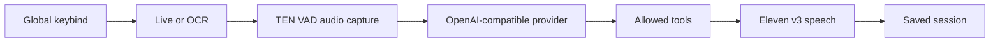
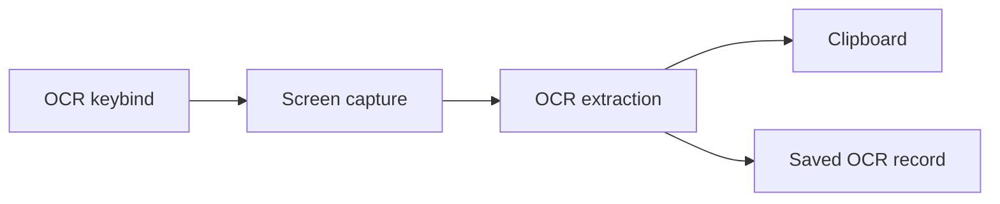

<div align="center">
  
  <h1>Glance</h1>
  <p><strong>A menu bar agent for quick voice help and OCR.</strong></p>
  <p>
    
    
    
    
  </p>
  
</div>

## Short Version

Glance is a live agent app. I can call it with a shortcut from wherever I am, talk to it, and get a spoken answer. If I only need text from the screen, I can use OCR instead.

The app is intentionally small on the surface: menu bar icon, keybinds, settings, Live, OCR. Under that, it has provider configuration, audio capture, tool execution, memory, history, and file persistence.

## Why I Built It

Most AI tools still expect me to stop what I am doing, switch windows, paste context, type a message, wait, and copy the result back. Glance tries to remove that friction.

The goal of this coursework project was to build a real Python application that uses OOP properly, not just to force classes into a small script. Glance needs OOP because it has separate responsibilities: UI, hotkeys, audio, providers, tools, storage, strategies, and data models.

## App Flow



OCR is shorter:



## Main Features

| Feature | What it means |
| --- | --- |
| Live agent | Speak from anywhere and get a spoken answer. |
| OCR hotkey | Extract visible text and copy it immediately. |
| Configurable endpoints | Use OpenAI-compatible base URLs, keys, and models. |
| Tool permissions | Decide which tools the live model is allowed to use. |
| Memories | Save, search, and update notes from Live mode. |
| History | Keep sessions, transcripts, tool calls, audio, screenshots, and Markdown. |
| Electron settings | Configure the Python runtime from a native-feeling settings window. |

## Tools The Agent Can Use

- `take_screenshot` captures the current screen when visual context is needed.
- `ocr_screen` captures the primary screen, extracts requested text, copies it to the clipboard, and records the result.
- `web_search` searches public web results for current information.
- `web_fetch` reads a specific public page and returns concise page text.
- `add_memory` saves a note, preference, follow-up, plan, or project detail.
- `read_memory` searches saved memories by the user's natural wording.
- `change_memory` updates one saved memory when the target is clear.
- `end_live_session` stops the current Live session when the user is done.

## Install And Run

```bash
python3 -m venv .venv
source .venv/bin/activate
python -m pip install -r requirements.txt

bun install
GLANCE_PYTHON=.venv/bin/python bun run dev:desktop
```

Build and run:

```bash
bun run build
.venv/bin/python main.py
```

CLI:

```bash
.venv/bin/python main.py --cli
```

## How To Use Glance

1. Start the app.
2. Open settings with `CMD+SHIFT+G`.
3. Add the reply, transcription, and voice provider details.
4. Check microphone and speaker devices.
5. Enable Live tools if needed.
6. Press `CMD+SHIFT+L` and speak.
7. Press `CMD+SHIFT+O` for OCR.

## Coursework Requirements

| Requirement | Where it appears |
| --- | --- |
| Python program | Main runtime is Python in `src/`. |
| GitHub project | Project is structured as a Git repository with source, tests, docs, and README. |
| OOP pillars | Agents, strategies, repositories, models, services, and managers show abstraction, encapsulation, inheritance, and polymorphism. |
| Design pattern | Strategy plus Factory Method for Live/OCR workflows. |
| Composition/aggregation | `Orchestrator` combines independent services. |
| File read/write | Config, sessions, memories, Markdown, audio, screenshots, and tool artifacts. |
| Testing | Python `unittest` plus Node tests for Electron behavior. |
| Report structure | This README includes introduction, analysis, results, conclusions, and usage. |

## OOP Analysis

### Abstraction

The app defines contracts:

```python
class ModeStrategy(ABC):
    @abstractmethod
    def execute(self, context: dict) -> BaseInteraction:
        "Run one mode workflow and return the resulting interaction."
```

Live and OCR are different workflows, but both can be treated as a `ModeStrategy`.

### Encapsulation

Tool rules are hidden inside `RuntimeToolRegistry`. Settings validation is hidden inside `AppSettings`. Session folders are hidden behind `SessionDirectoryRepository`. This stops the rest of the app from spreading file and validation logic everywhere.

### Inheritance

`LiveStrategy` and `OCRStrategy` inherit from `ModeStrategy`. Agent classes inherit from `BaseAgent`. Interaction records inherit from `BaseInteraction`. Repositories inherit from `AbstractRepository`.

### Polymorphism

The orchestrator does not care which concrete strategy it receives:

```python
interaction = strategy.execute(execution_context)
```

The same call works for both workflows.

### Composition

The orchestrator has references to its collaborators instead of doing everything itself. That includes providers, agents, history, memory, strategy factory, screen capture, TTS, OCR, and clipboard.

## Design Pattern Choice

I used Strategy because Live and OCR are different behaviors selected at runtime. The factory keeps selection logic in one place:

```python
if normalized_mode == "ocr":
    return OCRStrategy(...)
if normalized_mode == "live":
    return LiveStrategy(...)
```

This is a better fit than making one class with a large `if` block in the middle of the workflow.

## File Persistence

Glance reads and writes:

- `config.json` for user settings.
- `session.json` for structured history.
- `conversation.md` for readable history.
- `memories.json` for user memory.
- Audio files for recordings and spoken replies.
- Images for screenshots and OCR.
- Tool result files for executed tools.

## Tests

Useful commands:

```bash
.venv/bin/python -m unittest discover -s tests
node --test tests/electron_window_control.test.js tests/electron_window_chrome.test.js
bun run typecheck
bun run build
```

## Results

- The app can be opened from the menu bar and controlled with global keybinds.
- Live mode works as a complete pipeline from speech input to spoken output.
- OCR mode handles quick text extraction.
- Tool calls are controlled by settings and saved into session history.
- The Python runtime and Electron UI work together while keeping runtime logic in Python.

## Conclusions

Glance is a practical OOP application. It has enough moving parts to justify the architecture: strategies for workflows, agents for model-related actions, repositories for persistence, services for focused runtime jobs, and models for data.

If I extend it, I would first package it as a normal macOS app, then improve first-run setup and add a cleaner tool permission system.
