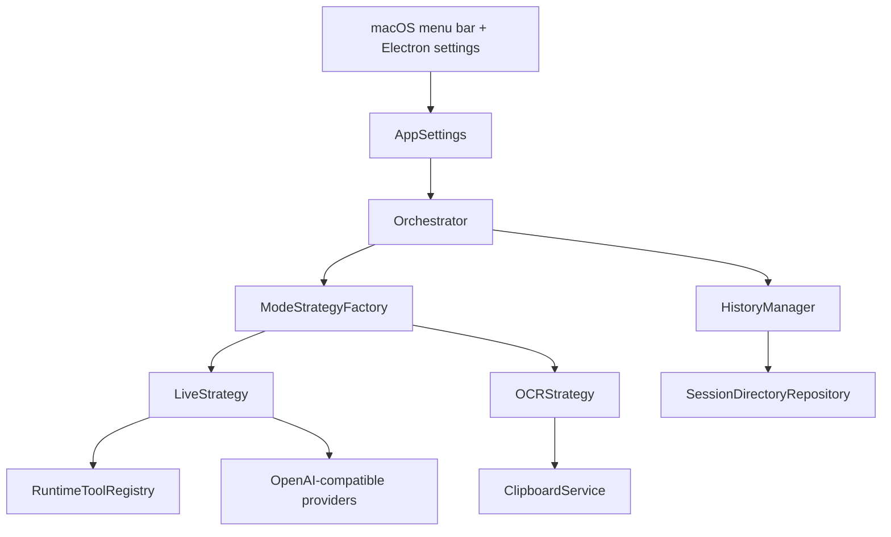

<div align="center">
  
  <h1>Glance</h1>
  <p><strong>A Python desktop runtime with a live voice agent, OCR, tools, and an Electron settings shell.</strong></p>
  <p>
    
    
    
    
  </p>
  
</div>

## Introduction

Glance is a macOS desktop agent. Its main workflow is Live mode: the user presses a shortcut, speaks, and receives a spoken answer. It also has OCR mode for quick text extraction from the screen.

This project was built for OOP coursework. The report is included in this README, because the coursework requires the program and Markdown report to be uploaded together.

## Runtime Overview



The Python runtime owns the real app behavior. Electron only renders the settings UI and talks to Python through a local bridge.

## User Features

- Call the app from anywhere using global keybinds.
- Run Live voice turns with configurable models.
- Extract text with OCR and copy it to the clipboard.
- Use OpenAI-compatible endpoints for reply, transcription, and voice.
- Use Live tools for screenshots, OCR, web search, web fetch, and memories.
- Save sessions with audio, transcripts, responses, screenshots, tool calls, and Markdown.
- Manage preferences in the Electron settings window.

## Live Tools

The tool registry in `src/tools/runtime.py` exposes these tools:

| Tool | Runtime behavior |
| --- | --- |
| `take_screenshot` | Captures the current screen for visual context. |
| `ocr_screen` | Captures the primary screen, extracts requested text, copies it to the clipboard, and stores the artifact. |
| `web_search` | Searches for current public information. |
| `web_fetch` | Reads one public `http`/`https` page. |
| `add_memory` | Saves a note or preference when the user explicitly wants it remembered. |
| `read_memory` | Searches saved memories and returns compact ranked matches. |
| `change_memory` | Updates an existing memory by ID or clear natural-language query. |
| `end_live_session` | Ends Live mode when the user says they are done. |

## Running

```bash
python3 -m venv .venv
source .venv/bin/activate
python -m pip install -r requirements.txt

bun install
GLANCE_PYTHON=.venv/bin/python bun run dev:desktop
```

Build:

```bash
bun run build
.venv/bin/python main.py
```

CLI fallback:

```bash
.venv/bin/python main.py --cli
```

## Usage

1. Start the app.
2. Open the settings window.
3. Configure providers and models.
4. Configure audio devices, voice, and keybinds.
5. Enable tools if the agent should use screen, web, or memory context.
6. Use Live for spoken help.
7. Use OCR for text extraction.

## OOP Pillars

### Abstraction

The project uses abstract classes to describe behavior:

```python
class AbstractRepository(ABC, Generic[T]):
    @abstractmethod
    def load(self) -> list[T]:
        "Load all entities from persistent storage."
```

Other examples are `BaseAgent`, `ModeStrategy`, and `BaseInteraction`.

### Encapsulation

Classes keep their internal details private:

- `AppSettings` validates and normalizes settings.
- `RuntimeToolRegistry` controls tool policies.
- `MemoryManager` owns memory search/update behavior.
- `SessionDirectoryRepository` owns session folders and artifact paths.
- `TenVadAudioRecorder` owns audio frame processing and WAV writing.

### Inheritance

Inheritance is used for shared contracts and common model behavior:

- `BaseEntity` -> `BaseInteraction` -> `LiveInteraction` / `OCRInteraction`
- `BaseAgent` -> `LLMAgent`, `OCRAgent`, `TTSAgent`, `TranscriptionAgent`, `ScreenCaptureAgent`
- `ModeStrategy` -> `LiveStrategy`, `OCRStrategy`
- `AbstractRepository` -> `SessionDirectoryRepository`

### Polymorphism

The orchestrator uses strategies through the same method:

```python
strategy = self._strategy_factory.create(mode=mode, ...)
interaction = strategy.execute(execution_context)
```

The concrete object can change, while the call site stays stable.

## Composition / Aggregation

`Orchestrator` aggregates the app's main services:

- settings
- history manager
- memory manager
- strategy factory
- screen capture agent
- transcription agent
- LLM agent
- OCR agent
- TTS agent
- clipboard service

This keeps dependencies visible and replaceable. It also makes testing easier because fake providers or services can be passed into the runtime.

## Design Pattern

The main pattern is **Strategy**.

`LiveStrategy` handles speech, transcription, tool calls, model replies, and TTS. `OCRStrategy` handles screen capture, OCR extraction, and clipboard copying. They are separate because they are different algorithms.

`ModeStrategyFactory` is a small **Factory Method** implementation. It creates the correct strategy from the requested mode.

## File Read / Write

The project satisfies file persistence through:

| File/output | Purpose |
| --- | --- |
| `~/.glance/config.json` | Saved app settings. |
| `~/.glance/sessions/*/session.json` | Structured session history. |
| `~/.glance/sessions/*/conversation.md` | Human-readable history export. |
| `~/.glance/memories.json` | Saved Live memories. |
| `turn-*-user.wav` | User recordings. |
| `turn-*-assistant.mp3` | Generated voice replies. |
| `turn-*-image.png` | Screenshots/OCR captures. |
| `turn-*-tool-*` | Tool results and artifacts. |

## Testing

```bash
.venv/bin/python -m unittest discover -s tests
node --test tests/electron_window_control.test.js tests/electron_window_chrome.test.js
bun run typecheck
bun run build
```

The tests cover storage, settings, providers, tools, memory, OCR, Live behavior, hotkeys, Electron control, and runtime status.

## Results

- Implemented a working macOS menu bar assistant.
- Implemented Live mode with speech recording, model calls, optional tool use, and voice output.
- Implemented OCR mode with clipboard copying.
- Implemented JSON/Markdown persistence for settings, sessions, memories, and artifacts.
- Implemented a tested OOP architecture with strategies, agents, repositories, models, and services.

## Conclusions

Glance meets the coursework requirements because it is a real Python OOP application with file persistence and tests. The architecture is practical: workflows are strategies, model actions are agents, storage is behind repositories, and the orchestrator composes the runtime.

Future work would focus on packaging, first-run setup, better tool management, and more robust provider presets.
